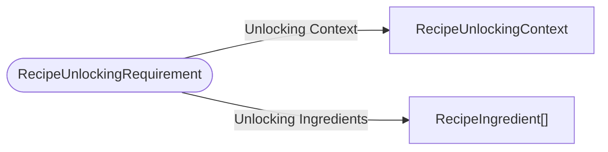

# RecipeUnlockingRequirement

`struct`

```mermaid
flowchart LR
  ROOT(["RecipeUnlockingRequirement"])
  ROOT -->|"Unlocking Context"| RecipeUnlockingContext["RecipeUnlockingContext"]
  ROOT -->|"Unlocking Ingredients"| RecipeIngredient["RecipeIngredient[]"]
```

