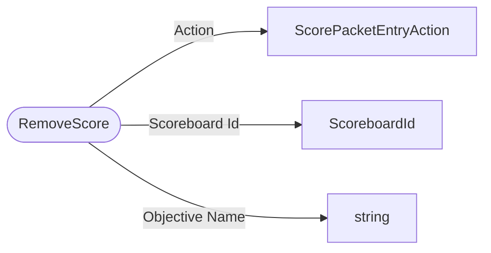

# RemoveScore

`struct`

```mermaid
flowchart LR
  ROOT(["RemoveScore"])
  ROOT -->|"Action"| ScorePacketEntryAction["ScorePacketEntryAction"]
  ROOT -->|"Scoreboard Id"| ScoreboardId["ScoreboardId"]
  ROOT -->|"Objective Name"| string["string"]
```

