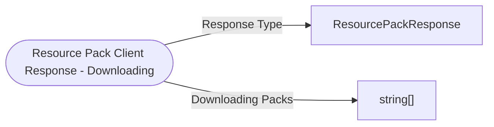

# Resource Pack Client Response - Downloading

`struct`

```mermaid
flowchart LR
  ROOT(["Resource Pack Client Response - Downloading"])
  ROOT -->|"Response Type"| ResourcePackResponse["ResourcePackResponse"]
  ROOT -->|"Downloading Packs"| string["string[]"]
```

