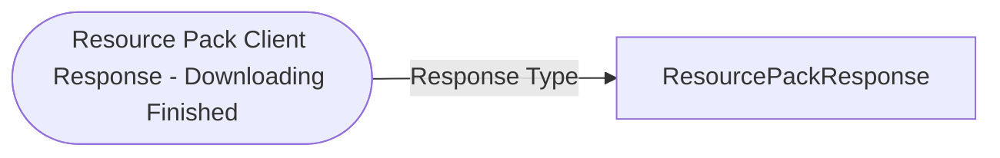

# Resource Pack Client Response - Downloading Finished

`struct`

```mermaid
flowchart LR
  ROOT(["Resource Pack Client Response - Downloading Finished"])
  ROOT -->|"Response Type"| ResourcePackResponse["ResourcePackResponse"]
```

