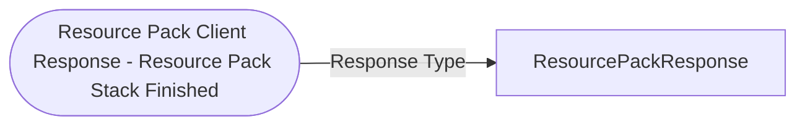

# Resource Pack Client Response - Resource Pack Stack Finished

`struct`

```mermaid
flowchart LR
  ROOT(["Resource Pack Client Response - Resource Pack Stack Finished"])
  ROOT -->|"Response Type"| ResourcePackResponse["ResourcePackResponse"]
```

