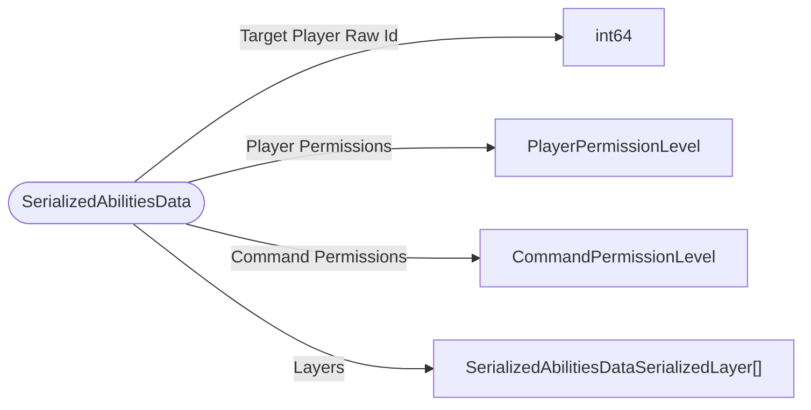

# SerializedAbilitiesData

`struct`

```mermaid
flowchart LR
  ROOT(["SerializedAbilitiesData"])
  ROOT -->|"Target Player Raw Id"| int64["int64"]
  ROOT -->|"Player Permissions"| PlayerPermissionLevel["PlayerPermissionLevel"]
  ROOT -->|"Command Permissions"| CommandPermissionLevel["CommandPermissionLevel"]
  ROOT -->|"Layers"| SerializedAbilitiesDataSerializedLayer["SerializedAbilitiesDataSerializedLayer[]"]
```

