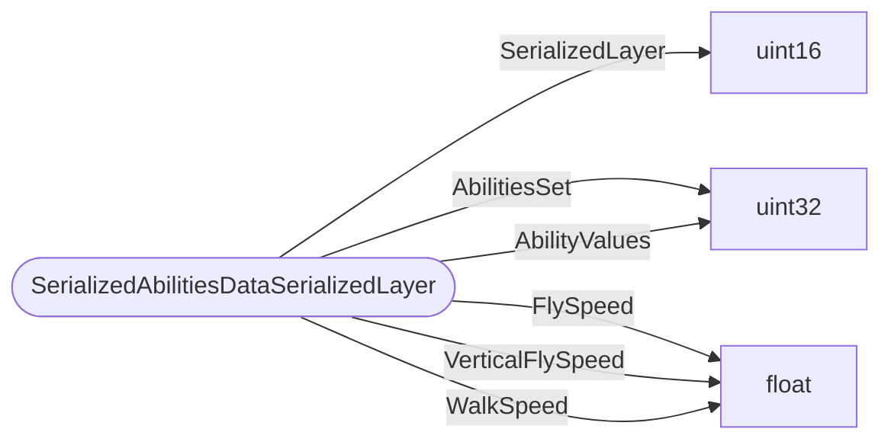

# SerializedAbilitiesDataSerializedLayer

`struct`

```mermaid
flowchart LR
  ROOT(["SerializedAbilitiesDataSerializedLayer"])
  ROOT -->|"SerializedLayer"| uint16["uint16"]
  ROOT -->|"AbilitiesSet"| uint32["uint32"]
  ROOT -->|"AbilityValues"| uint32["uint32"]
  ROOT -->|"FlySpeed"| float["float"]
  ROOT -->|"VerticalFlySpeed"| float["float"]
  ROOT -->|"WalkSpeed"| float["float"]
```

