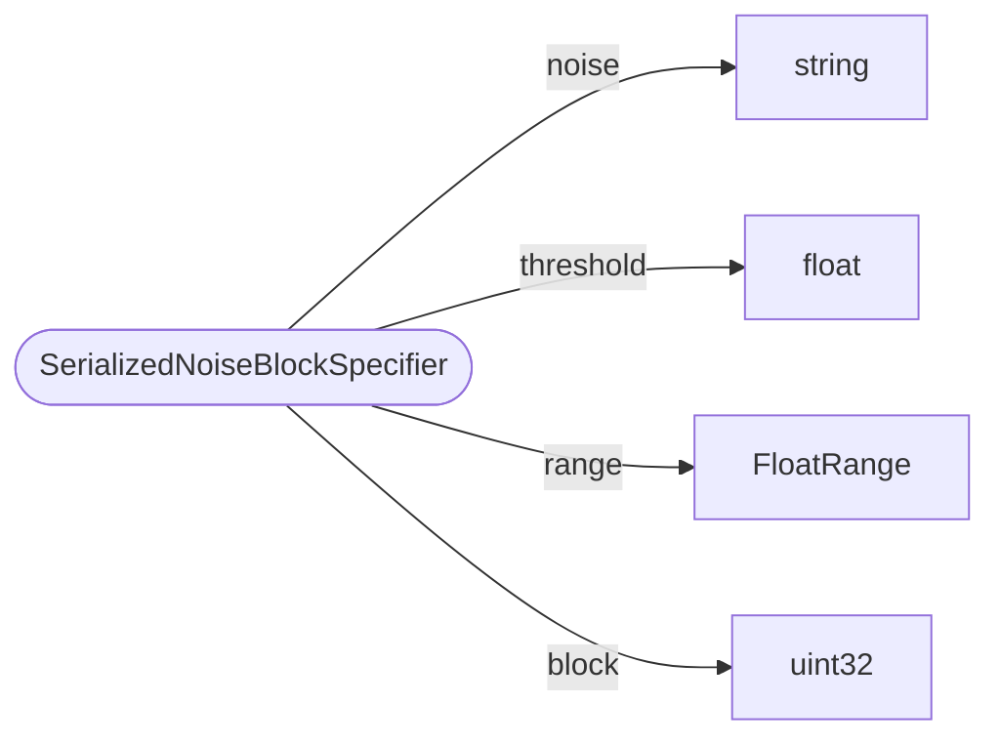

# SerializedNoiseBlockSpecifier

`struct`

```mermaid
flowchart LR
  ROOT(["SerializedNoiseBlockSpecifier"])
  ROOT -->|"noise"| string["string"]
  ROOT -->|"threshold"| float["float"]
  ROOT -->|"range"| FloatRange["FloatRange"]
  ROOT -->|"block"| uint32["uint32"]
```

