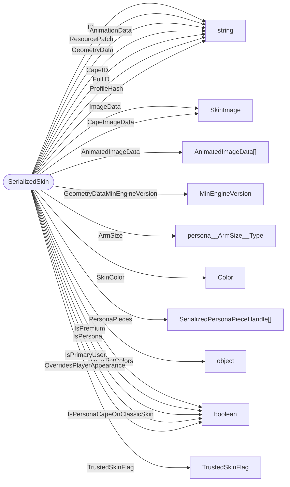

# SerializedSkin

`struct`

```mermaid
flowchart LR
  ROOT(["SerializedSkin"])
  ROOT -->|"ID"| string["string"]
  ROOT -->|"ResourcePatch"| string["string"]
  ROOT -->|"ImageData"| SkinImage["SkinImage"]
  ROOT -->|"AnimatedImageData"| AnimatedImageData["AnimatedImageData[]"]
  ROOT -->|"CapeImageData"| SkinImage["SkinImage"]
  ROOT -->|"GeometryData"| string["string"]
  ROOT -->|"GeometryDataMinEngineVersion"| MinEngineVersion["MinEngineVersion"]
  ROOT -->|"AnimationData"| string["string"]
  ROOT -->|"CapeID"| string["string"]
  ROOT -->|"FullID"| string["string"]
  ROOT -->|"ArmSize"| persona__ArmSize__Type["persona__ArmSize__Type"]
  ROOT -->|"SkinColor"| Color["Color"]
  ROOT -->|"PersonaPieces"| SerializedPersonaPieceHandle["SerializedPersonaPieceHandle[]"]
  ROOT -->|"PieceTintColors"| object["object"]
  ROOT -->|"IsPremium"| boolean["boolean"]
  ROOT -->|"IsPersona"| boolean["boolean"]
  ROOT -->|"IsPersonaCapeOnClassicSkin"| boolean["boolean"]
  ROOT -->|"IsPrimaryUser"| boolean["boolean"]
  ROOT -->|"OverridesPlayerAppearance"| boolean["boolean"]
  ROOT -->|"TrustedSkinFlag"| TrustedSkinFlag["TrustedSkinFlag"]
  ROOT -->|"ProfileHash"| string["string"]
```

