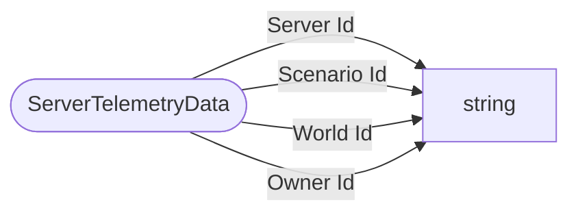

# ServerTelemetryData

`struct`

```mermaid
flowchart LR
  ROOT(["ServerTelemetryData"])
  ROOT -->|"Server Id"| string["string"]
  ROOT -->|"Scenario Id"| string["string"]
  ROOT -->|"World Id"| string["string"]
  ROOT -->|"Owner Id"| string["string"]
```

