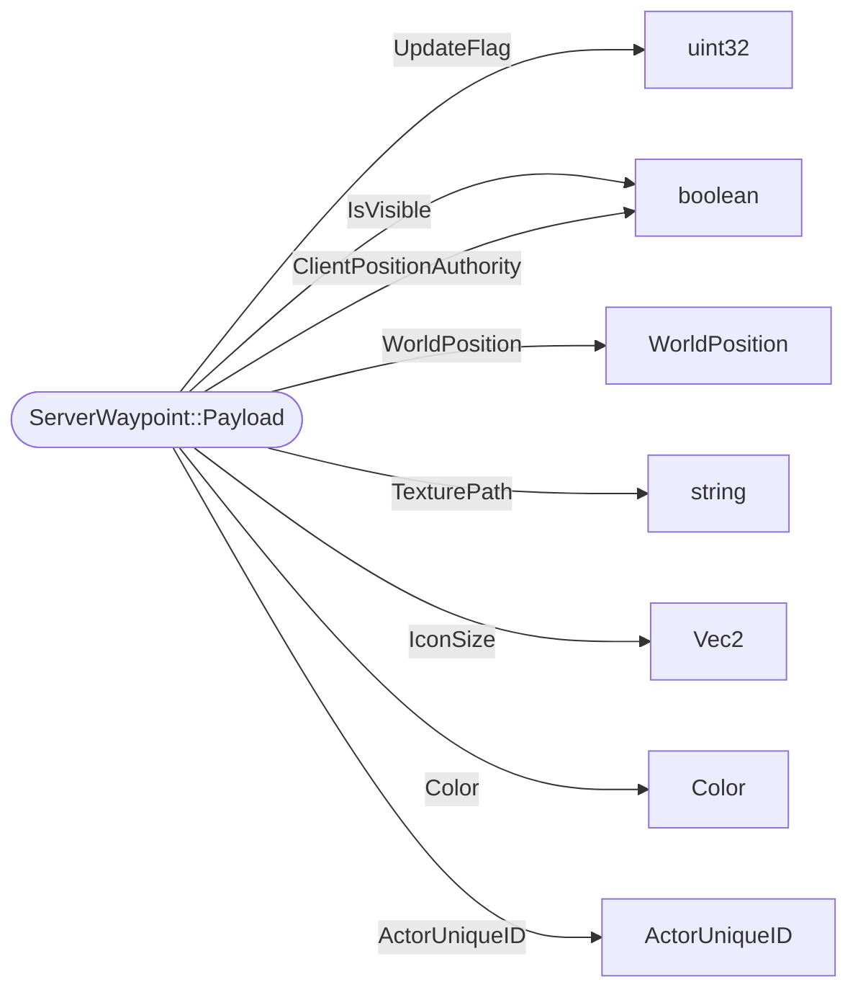

# ServerWaypoint::Payload

`struct`

```mermaid
flowchart LR
  ROOT(["ServerWaypoint::Payload"])
  ROOT -->|"UpdateFlag"| uint32["uint32"]
  ROOT -->|"IsVisible"| boolean["boolean"]
  ROOT -->|"WorldPosition"| WorldPosition["WorldPosition"]
  ROOT -->|"TexturePath"| string["string"]
  ROOT -->|"IconSize"| Vec2["Vec2"]
  ROOT -->|"Color"| Color["Color"]
  ROOT -->|"ClientPositionAuthority"| boolean["boolean"]
  ROOT -->|"ActorUniqueID"| ActorUniqueID["ActorUniqueID"]
```

