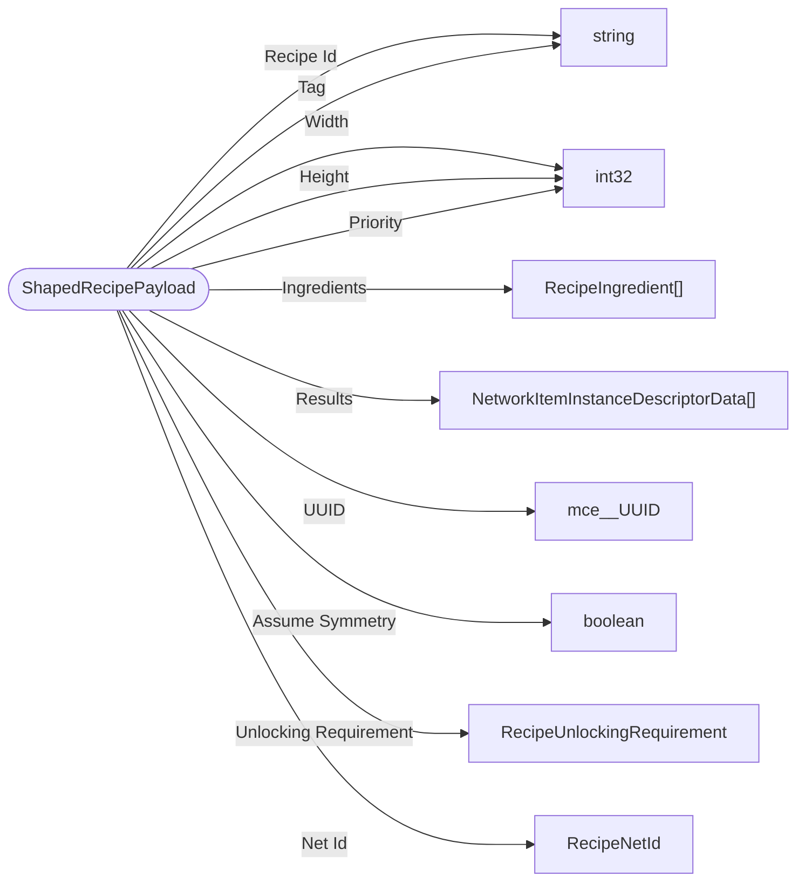

# ShapedRecipePayload

`struct`

```mermaid
flowchart LR
  ROOT(["ShapedRecipePayload"])
  ROOT -->|"Recipe Id"| string["string"]
  ROOT -->|"Width"| int32["int32"]
  ROOT -->|"Height"| int32["int32"]
  ROOT -->|"Ingredients"| RecipeIngredient["RecipeIngredient[]"]
  ROOT -->|"Results"| NetworkItemInstanceDescriptorData["NetworkItemInstanceDescriptorData[]"]
  ROOT -->|"UUID"| mce__UUID["mce__UUID"]
  ROOT -->|"Tag"| string["string"]
  ROOT -->|"Priority"| int32["int32"]
  ROOT -->|"Assume Symmetry"| boolean["boolean"]
  ROOT -->|"Unlocking Requirement"| RecipeUnlockingRequirement["RecipeUnlockingRequirement"]
  ROOT -->|"Net Id"| RecipeNetId["RecipeNetId"]
```

