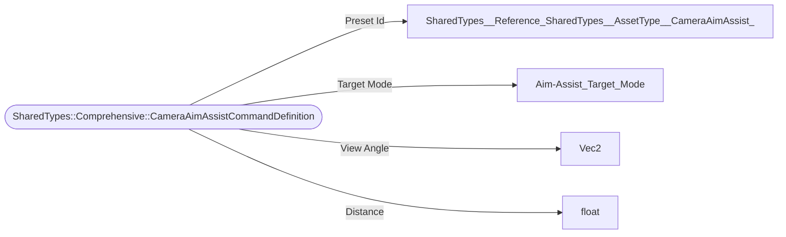

# SharedTypes::Comprehensive::CameraAimAssistCommandDefinition

`struct`

- protocol: 2168
- minecraft: 1.26.40

```mermaid
flowchart LR
  ROOT(["SharedTypes::Comprehensive::CameraAimAssistCommandDefinition"])
  ROOT -->|"Preset Id"| SharedTypes__Reference_SharedTypes__AssetType__CameraAimAssist_["SharedTypes__Reference_SharedTypes__AssetType__CameraAimAssist_"]
  ROOT -->|"Target Mode"| Aim_Assist_Target_Mode["Aim-Assist_Target_Mode"]
  ROOT -->|"View Angle"| Vec2["Vec2"]
  ROOT -->|"Distance"| float["float"]
```

