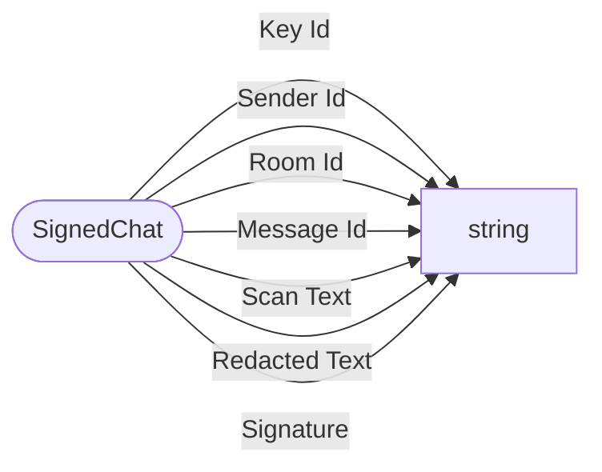

# SignedChat

`struct`

```mermaid
flowchart LR
  ROOT(["SignedChat"])
  ROOT -->|"Key Id"| string["string"]
  ROOT -->|"Sender Id"| string["string"]
  ROOT -->|"Room Id"| string["string"]
  ROOT -->|"Message Id"| string["string"]
  ROOT -->|"Scan Text"| string["string"]
  ROOT -->|"Redacted Text"| string["string"]
  ROOT -->|"Signature"| string["string"]
```

