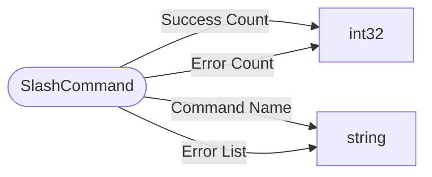

# SlashCommand

`struct`

```mermaid
flowchart LR
  ROOT(["SlashCommand"])
  ROOT -->|"Success Count"| int32["int32"]
  ROOT -->|"Error Count"| int32["int32"]
  ROOT -->|"Command Name"| string["string"]
  ROOT -->|"Error List"| string["string"]
```

