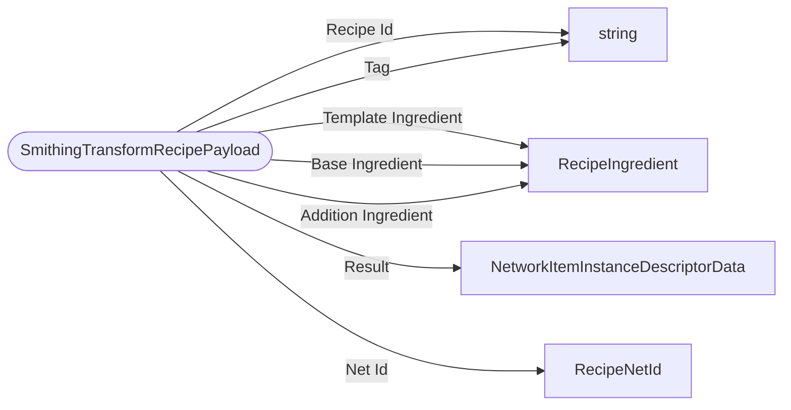

# SmithingTransformRecipePayload

`struct`

```mermaid
flowchart LR
  ROOT(["SmithingTransformRecipePayload"])
  ROOT -->|"Recipe Id"| string["string"]
  ROOT -->|"Template Ingredient"| RecipeIngredient["RecipeIngredient"]
  ROOT -->|"Base Ingredient"| RecipeIngredient["RecipeIngredient"]
  ROOT -->|"Addition Ingredient"| RecipeIngredient["RecipeIngredient"]
  ROOT -->|"Result"| NetworkItemInstanceDescriptorData["NetworkItemInstanceDescriptorData"]
  ROOT -->|"Tag"| string["string"]
  ROOT -->|"Net Id"| RecipeNetId["RecipeNetId"]
```

