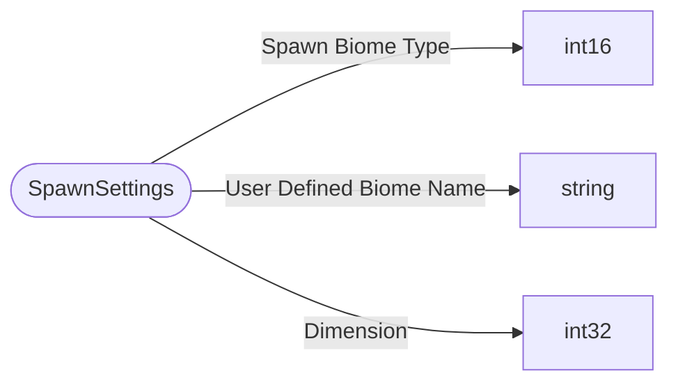

# SpawnSettings

`struct`

```mermaid
flowchart LR
  ROOT(["SpawnSettings"])
  ROOT -->|"Spawn Biome Type"| int16["int16"]
  ROOT -->|"User Defined Biome Name"| string["string"]
  ROOT -->|"Dimension"| int32["int32"]
```

