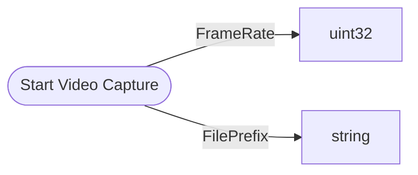

# Start Video Capture

`struct`

- protocol: 2168
- minecraft: 1.26.40

```mermaid
flowchart LR
  ROOT(["Start Video Capture"])
  ROOT -->|"FrameRate"| uint32["uint32"]
  ROOT -->|"FilePrefix"| string["string"]
```

