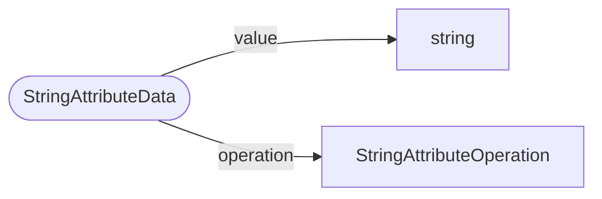

# StringAttributeData

`struct`

```mermaid
flowchart LR
  ROOT(["StringAttributeData"])
  ROOT -->|"value"| string["string"]
  ROOT -->|"operation"| StringAttributeOperation["StringAttributeOperation"]
```

