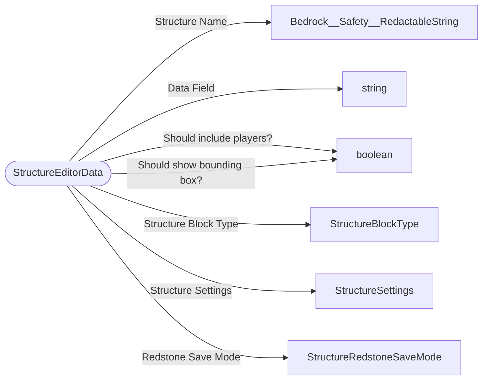

# StructureEditorData

`struct`

```mermaid
flowchart LR
  ROOT(["StructureEditorData"])
  ROOT -->|"Structure Name"| Bedrock__Safety__RedactableString["Bedrock__Safety__RedactableString"]
  ROOT -->|"Data Field"| string["string"]
  ROOT -->|"Should include players?"| boolean["boolean"]
  ROOT -->|"Should show bounding box?"| boolean["boolean"]
  ROOT -->|"Structure Block Type"| StructureBlockType["StructureBlockType"]
  ROOT -->|"Structure Settings"| StructureSettings["StructureSettings"]
  ROOT -->|"Redstone Save Mode"| StructureRedstoneSaveMode["StructureRedstoneSaveMode"]
```

