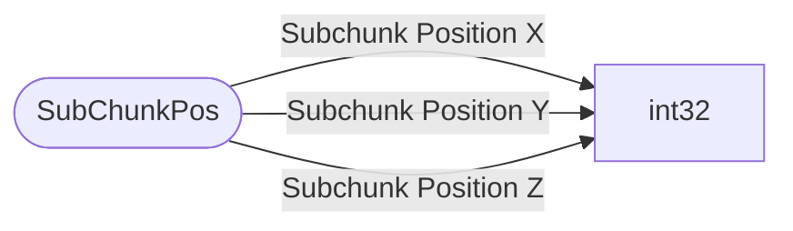

# SubChunkPos

`struct`

```mermaid
flowchart LR
  ROOT(["SubChunkPos"])
  ROOT -->|"Subchunk Position X"| int32["int32"]
  ROOT -->|"Subchunk Position Y"| int32["int32"]
  ROOT -->|"Subchunk Position Z"| int32["int32"]
```

