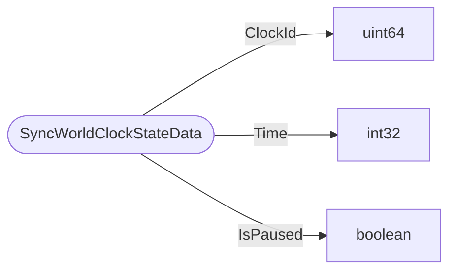

# SyncWorldClockStateData

`struct`

```mermaid
flowchart LR
  ROOT(["SyncWorldClockStateData"])
  ROOT -->|"ClockId"| uint64["uint64"]
  ROOT -->|"Time"| int32["int32"]
  ROOT -->|"IsPaused"| boolean["boolean"]
```

