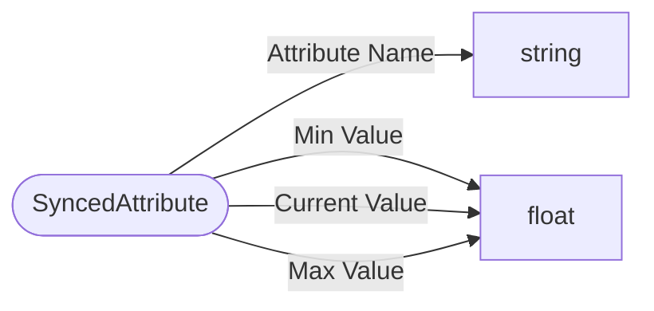

# SyncedAttribute

`struct`

```mermaid
flowchart LR
  ROOT(["SyncedAttribute"])
  ROOT -->|"Attribute Name"| string["string"]
  ROOT -->|"Min Value"| float["float"]
  ROOT -->|"Current Value"| float["float"]
  ROOT -->|"Max Value"| float["float"]
```

