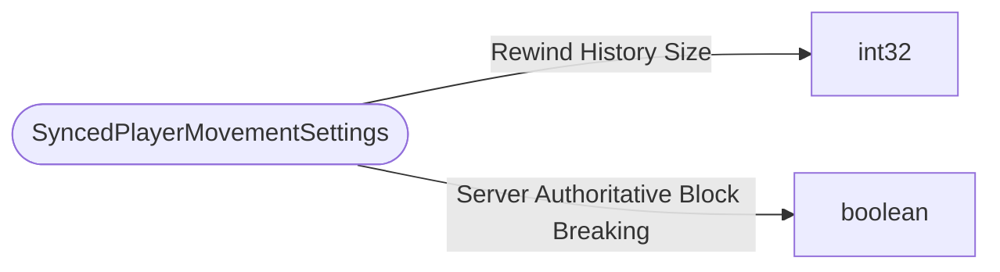

# SyncedPlayerMovementSettings

`struct`

```mermaid
flowchart LR
  ROOT(["SyncedPlayerMovementSettings"])
  ROOT -->|"Rewind History Size"| int32["int32"]
  ROOT -->|"Server Authoritative Block Breaking"| boolean["boolean"]
```

