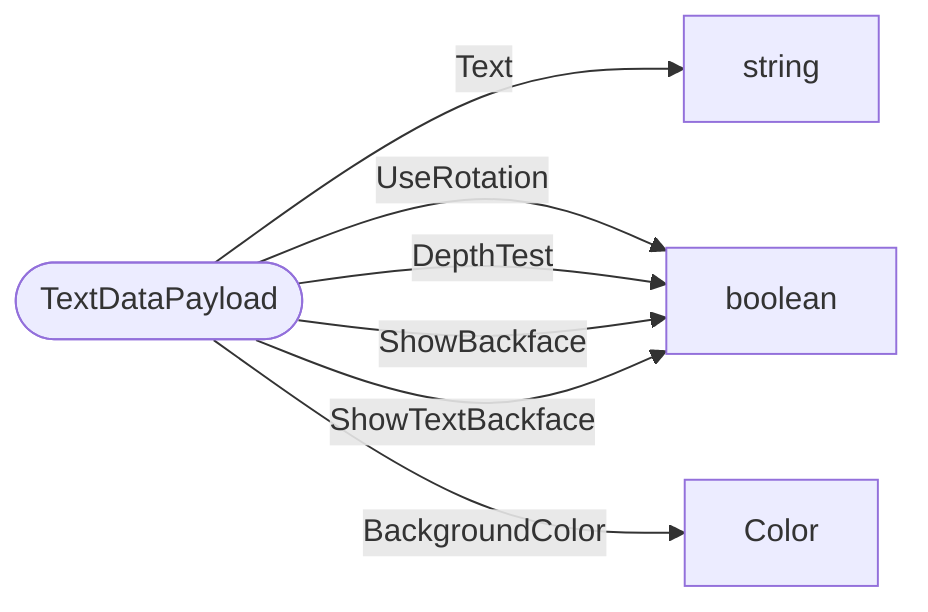

# TextDataPayload

`struct`

```mermaid
flowchart LR
  ROOT(["TextDataPayload"])
  ROOT -->|"Text"| string["string"]
  ROOT -->|"UseRotation"| boolean["boolean"]
  ROOT -->|"BackgroundColor"| Color["Color"]
  ROOT -->|"DepthTest"| boolean["boolean"]
  ROOT -->|"ShowBackface"| boolean["boolean"]
  ROOT -->|"ShowTextBackface"| boolean["boolean"]
```

