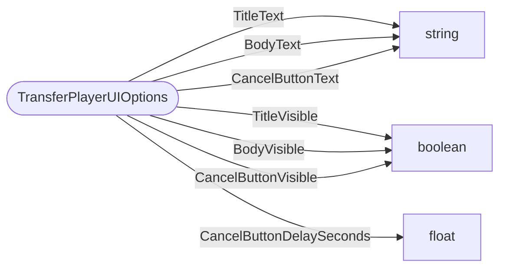

# TransferPlayerUIOptions

`struct`

```mermaid
flowchart LR
  ROOT(["TransferPlayerUIOptions"])
  ROOT -->|"TitleText"| string["string"]
  ROOT -->|"BodyText"| string["string"]
  ROOT -->|"TitleVisible"| boolean["boolean"]
  ROOT -->|"BodyVisible"| boolean["boolean"]
  ROOT -->|"CancelButtonText"| string["string"]
  ROOT -->|"CancelButtonVisible"| boolean["boolean"]
  ROOT -->|"CancelButtonDelaySeconds"| float["float"]
```

