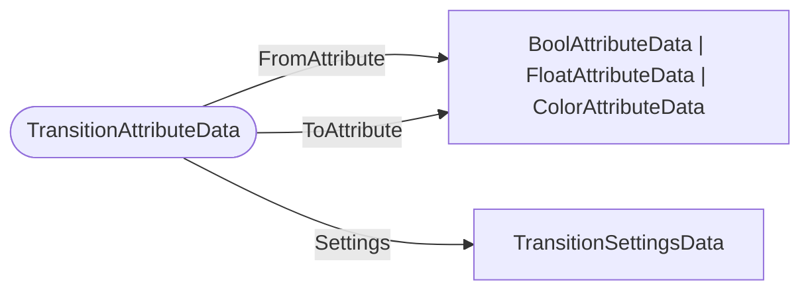

# TransitionAttributeData

`struct`

```mermaid
flowchart LR
  ROOT(["TransitionAttributeData"])
  ROOT -->|"FromAttribute"| BoolAttributeData___FloatAttributeData___ColorAttributeData["BoolAttributeData | FloatAttributeData | ColorAttributeData"]
  ROOT -->|"ToAttribute"| BoolAttributeData___FloatAttributeData___ColorAttributeData["BoolAttributeData | FloatAttributeData | ColorAttributeData"]
  ROOT -->|"Settings"| TransitionSettingsData["TransitionSettingsData"]
```

