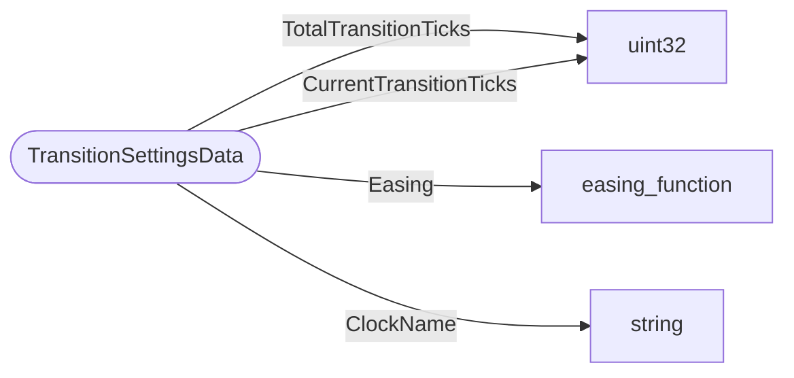

# TransitionSettingsData

`struct`

```mermaid
flowchart LR
  ROOT(["TransitionSettingsData"])
  ROOT -->|"TotalTransitionTicks"| uint32["uint32"]
  ROOT -->|"CurrentTransitionTicks"| uint32["uint32"]
  ROOT -->|"Easing"| easing_function["easing_function"]
  ROOT -->|"ClockName"| string["string"]
```

