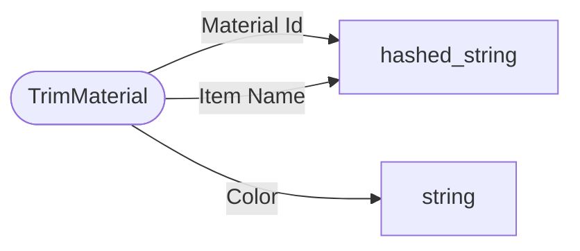

# TrimMaterial

`struct`

```mermaid
flowchart LR
  ROOT(["TrimMaterial"])
  ROOT -->|"Material Id"| hashed_string["hashed_string"]
  ROOT -->|"Color"| string["string"]
  ROOT -->|"Item Name"| hashed_string["hashed_string"]
```

