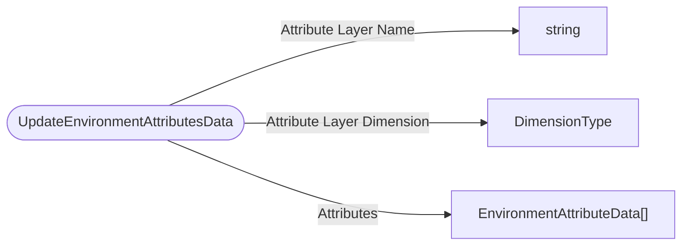

# UpdateEnvironmentAttributesData

`struct`

```mermaid
flowchart LR
  ROOT(["UpdateEnvironmentAttributesData"])
  ROOT -->|"Attribute Layer Name"| string["string"]
  ROOT -->|"Attribute Layer Dimension"| DimensionType["DimensionType"]
  ROOT -->|"Attributes"| EnvironmentAttributeData["EnvironmentAttributeData[]"]
```

