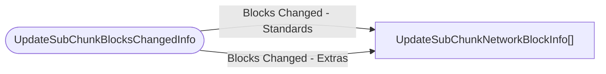

# UpdateSubChunkBlocksChangedInfo

`struct`

```mermaid
flowchart LR
  ROOT(["UpdateSubChunkBlocksChangedInfo"])
  ROOT -->|"Blocks Changed - Standards"| UpdateSubChunkNetworkBlockInfo["UpdateSubChunkNetworkBlockInfo[]"]
  ROOT -->|"Blocks Changed - Extras"| UpdateSubChunkNetworkBlockInfo["UpdateSubChunkNetworkBlockInfo[]"]
```

