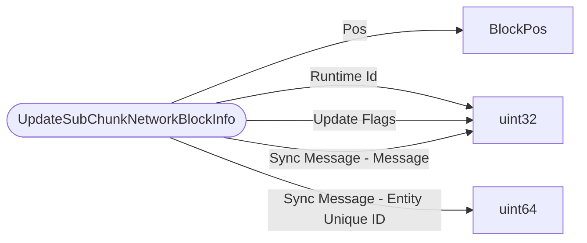

# UpdateSubChunkNetworkBlockInfo

`struct`

```mermaid
flowchart LR
  ROOT(["UpdateSubChunkNetworkBlockInfo"])
  ROOT -->|"Pos"| BlockPos["BlockPos"]
  ROOT -->|"Runtime Id"| uint32["uint32"]
  ROOT -->|"Update Flags"| uint32["uint32"]
  ROOT -->|"Sync Message - Entity Unique ID"| uint64["uint64"]
  ROOT -->|"Sync Message - Message"| uint32["uint32"]
```

