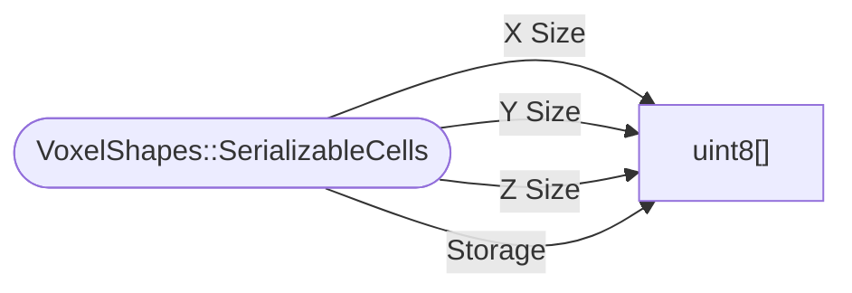

# VoxelShapes::SerializableCells

`struct`

```mermaid
flowchart LR
  ROOT(["VoxelShapes::SerializableCells"])
  ROOT -->|"X Size"| uint8["uint8"]
  ROOT -->|"Y Size"| uint8["uint8"]
  ROOT -->|"Z Size"| uint8["uint8"]
  ROOT -->|"Storage"| uint8["uint8[]"]
```

