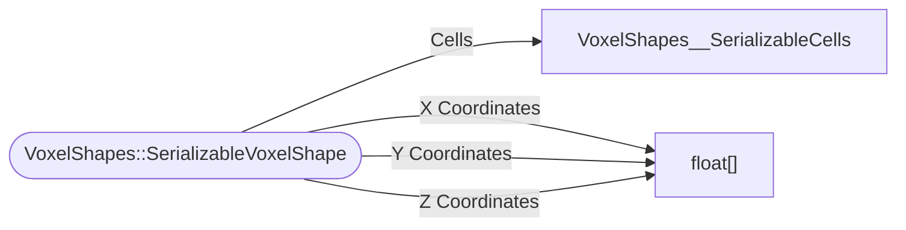

# VoxelShapes::SerializableVoxelShape

`struct`

```mermaid
flowchart LR
  ROOT(["VoxelShapes::SerializableVoxelShape"])
  ROOT -->|"Cells"| VoxelShapes__SerializableCells["VoxelShapes__SerializableCells"]
  ROOT -->|"X Coordinates"| float["float[]"]
  ROOT -->|"Y Coordinates"| float["float[]"]
  ROOT -->|"Z Coordinates"| float["float[]"]
```

