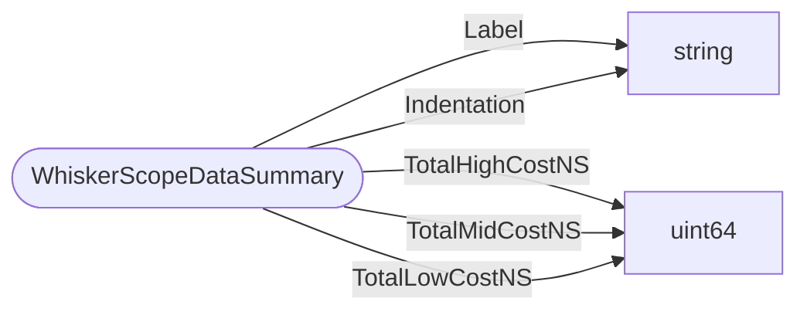

# WhiskerScopeDataSummary

`struct`

```mermaid
flowchart LR
  ROOT(["WhiskerScopeDataSummary"])
  ROOT -->|"Label"| string["string"]
  ROOT -->|"Indentation"| string["string"]
  ROOT -->|"TotalHighCostNS"| uint64["uint64"]
  ROOT -->|"TotalMidCostNS"| uint64["uint64"]
  ROOT -->|"TotalLowCostNS"| uint64["uint64"]
```

