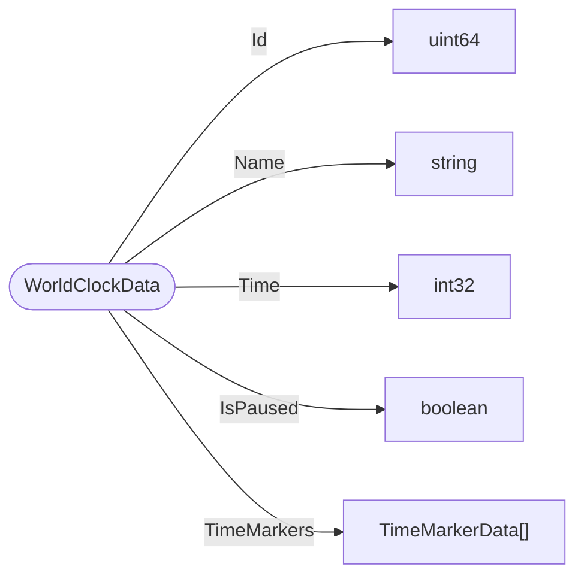

# WorldClockData

`struct`

```mermaid
flowchart LR
  ROOT(["WorldClockData"])
  ROOT -->|"Id"| uint64["uint64"]
  ROOT -->|"Name"| string["string"]
  ROOT -->|"Time"| int32["int32"]
  ROOT -->|"IsPaused"| boolean["boolean"]
  ROOT -->|"TimeMarkers"| TimeMarkerData["TimeMarkerData[]"]
```

