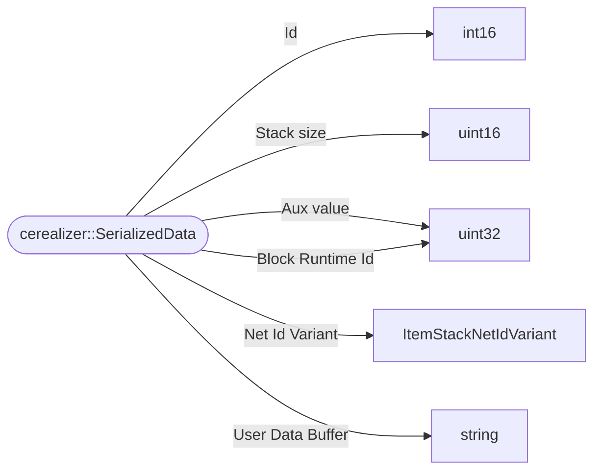

# cerealizer<NetworkItemStackDescriptor>::SerializedData

`struct`

```mermaid
flowchart LR
  ROOT(["cerealizer<NetworkItemStackDescriptor>::SerializedData"])
  ROOT -->|"Id"| int16["int16"]
  ROOT -->|"Stack size"| uint16["uint16"]
  ROOT -->|"Aux value"| uint32["uint32"]
  ROOT -->|"Net Id Variant"| ItemStackNetIdVariant["ItemStackNetIdVariant"]
  ROOT -->|"Block Runtime Id"| uint32["uint32"]
  ROOT -->|"User Data Buffer"| string["string"]
```

