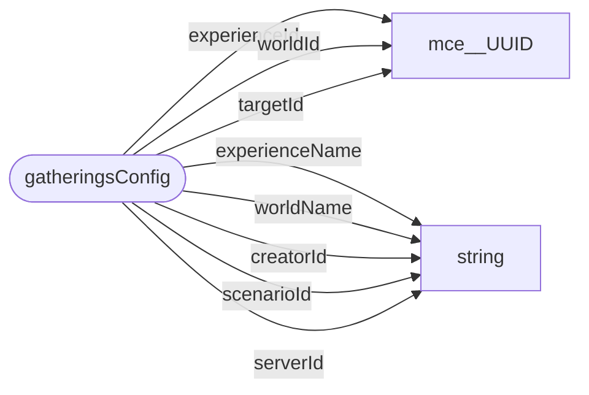

# gatheringsConfig

`struct`

```mermaid
flowchart LR
  ROOT(["gatheringsConfig"])
  ROOT -->|"experienceId"| mce__UUID["mce__UUID"]
  ROOT -->|"experienceName"| string["string"]
  ROOT -->|"worldId"| mce__UUID["mce__UUID"]
  ROOT -->|"worldName"| string["string"]
  ROOT -->|"creatorId"| string["string"]
  ROOT -->|"targetId"| mce__UUID["mce__UUID"]
  ROOT -->|"scenarioId"| string["string"]
  ROOT -->|"serverId"| string["string"]
```

