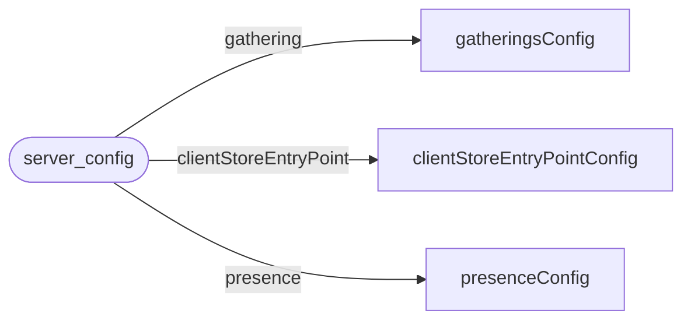

# server_config

`struct`

```mermaid
flowchart LR
  ROOT(["server_config"])
  ROOT -->|"gathering"| gatheringsConfig["gatheringsConfig"]
  ROOT -->|"clientStoreEntryPoint"| clientStoreEntryPointConfig["clientStoreEntryPointConfig"]
  ROOT -->|"presence"| presenceConfig["presenceConfig"]
```

